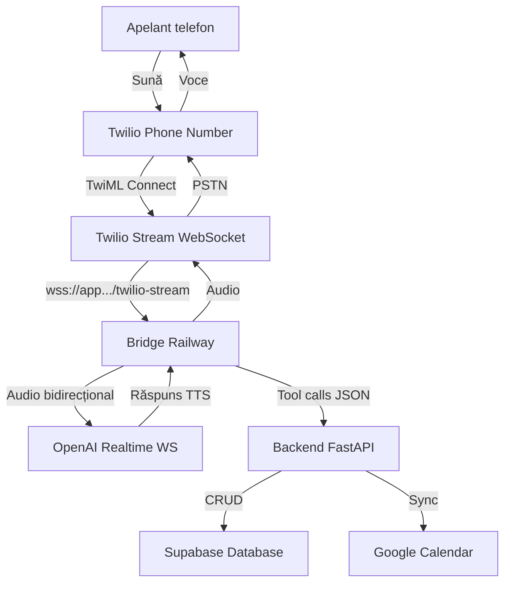
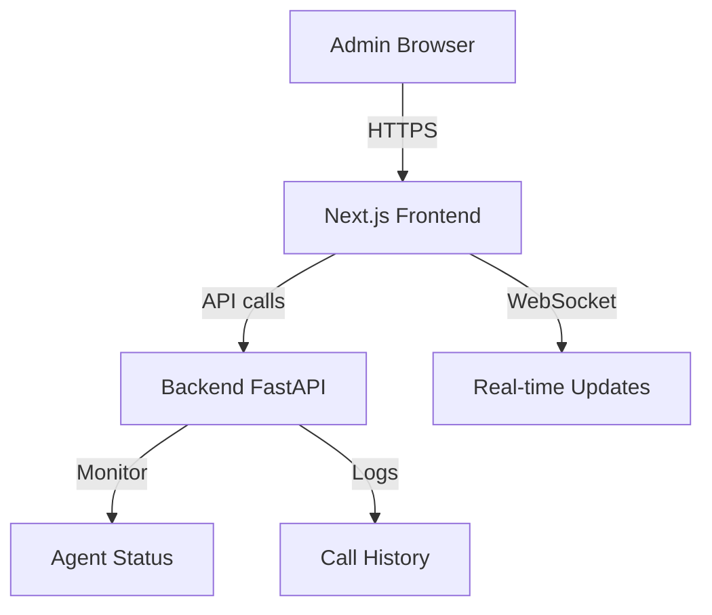

# 🎙️ Voice Booking App

> **Aplicație de programări prin telefon clasic pentru saloane/frizerii**  
> Powered by Twilio + OpenAI Realtime API + FastAPI + Next.js + Supabase

## 🎯 Descriere Proiect

Sistem de programări automatizat prin **apeluri telefonice reale**. Clienții sună la numărul salonului și sunt preluați automat de un AI agent vocal care procesează programările în română.

## 📞 Dual Interface Architecture

### 1. **CLIENȚI FINALI** - Telefon Clasic (PSTN)
**Modalitate**: Clienții sună numărul de telefon al salonului  
**Flow**: `Telefon → Twilio → Bridge → OpenAI Realtime → Booking`

**Flux Principal:**
1. **Apel telefonic** la numărul salonului
2. **Răspuns AI automat** în română: "Bună ziua! Salon Voice Booking, cu ce vă pot ajuta?"
3. **Conversație naturală** → "Vreau o programare pentru tuns mâine"
4. **Procesare vocală** → Identificare serviciu, verificare disponibilitate
5. **Colectare date** → Nume, confirmarea orei
6. **Programare finalizată** → Calendar sync + SMS confirmare

### 2. **PROPRIETAR SALON** - Dashboard Web
**Modalitate**: Interfață web pentru management și configurare  
**URL**: `https://voice-booking-app.vercel.app/admin`

**Funcționalități:**
- Dashboard cu toate programările
- Agent Vocal Control Center (configurare AI, monitorizare apeluri)
- Managementul clienților, serviciilor, statistici
- Setări business și program de lucru

---

## 🏗️ Arhitectură Tehnică Completă

### PSTN Call Flow (Clienti finali)


### Web Dashboard Flow (Proprietar salon)


### Stack Principal
- **Telefonie**: Twilio (PSTN numbers, Stream API, TwiML)
- **Voice Processing**: OpenAI Realtime API + audio bridge
- **Backend**: FastAPI + Python 3.11+ + WebSockets + Twilio Bridge
- **Frontend**: Next.js + React + TypeScript (Admin Panel Only)  
- **Database**: Supabase (PostgreSQL + Auth + Real-time)
- **Calendar**: Google Calendar API integration
- **Deployment**: Railway (Backend + Twilio Bridge) + Vercel (Admin Panel)

---

## 📁 Structura Proiect

```
voice-booking-app/
├── 📁 .claude/                    # Claude Code CLI configuration
│   ├── 📁 agents/                 # Specialized AI agents
│   └── 📄 project-context.md      # Project context for AI
├── 📁 frontend/                   # Next.js application
│   ├── 📁 src/
│   │   ├── 📁 components/         # React components
│   │   ├── 📁 pages/              # Next.js pages
│   │   ├── 📁 hooks/              # Custom React hooks
│   │   └── 📁 utils/              # Utility functions
│   ├── 📄 package.json
│   └── 📄 next.config.js
├── 📁 backend/                    # FastAPI application
│   ├── 📁 app/
│   │   ├── 📁 api/                # API endpoints
│   │   ├── 📁 models/             # Database models
│   │   ├── 📁 services/           # Business logic
│   │   └── 📁 core/               # Configuration
│   ├── 📄 requirements.txt
│   └── 📄 main.py
├── 📁 database/                   # Supabase migrations & schemas
│   ├── 📁 migrations/
│   └── 📁 schemas/
├── 📁 docs/                       # Documentation
├── 📄 docker-compose.yml          # Local development
├── 📄 .env.example                # Environment variables template
└── 📄 README.md                   # This file
```

---

## 🚀 Quick Start

### Prerequisite
- **Node.js** 18.0+
- **Python** 3.11+
- **Supabase** account
- **OpenAI** API key
- **Google Cloud** account (Calendar API)

### 1. Clone Repository
```bash
git clone https://github.com/your-username/voice-booking-app.git
cd voice-booking-app
```

### 2. Environment Setup
```bash
# Copy environment template
cp .env.example .env

# Edit with your API keys
nano .env
```

### 3. Backend Setup
```bash
cd backend
python -m venv venv
source venv/bin/activate  # Windows: venv\Scripts\activate
pip install -r requirements.txt
uvicorn app.main:app --reload --port 8000
```

### 4. Frontend Setup
```bash
cd frontend
npm install
npm run dev
```

### 5. Database Setup
```bash
# Supabase CLI
npx supabase start
npx supabase db reset
```

### 📞 Voice Testing (Development)
**Pentru testare locală cu Twilio:**
1. Configurează Twilio webhook: `https://your-ngrok-url/twilio/voice`
2. Sună numărul Twilio: `+40 XXX XXX XXX`
3. Conversație AI: *"Bună ziua! Cu ce vă pot ajuta?"*
4. Răspunde: *"Vreau o programare pentru tuns mâine"*
5. Urmează fluxul de programare vocală

**Admin Panel Testing:**
1. Deschide `http://localhost:3000/admin`
2. Vezi programările în timp real
3. Monitorizează apelurile în Agent Vocal section

---

## 🔧 Development Workflow

### Claude Code CLI Integration
```bash
# Initialize Claude agents
claude init voice-booking-app
claude agent create debugger --template=debugging
claude agent create reviewer --template=code-review
claude agent create database --template=database
claude agent create cicd --template=devops
```

### Git Workflow
```bash
# Feature development
git checkout -b feature/voice-integration
git add .
git commit -m "feat: add voice command processing"
git push origin feature/voice-integration

# Auto-triggers: Code review → Tests → Deployment
```

---

## 🗃️ Database Schema

### Core Tables
- **`users`** - Client information & authentication
- **`services`** - Available services (tuns, barbă, etc.) + duration
- **`bookings`** - Appointment records with start_time + end_time (UTC)
- **`business_hours`** - Working schedule (day_of_week, start_time, end_time)
- **`voice_sessions`** - Conversation logs + FSM state (GDPR compliant)

### Dynamic Availability Calculation
```sql
-- No availability_slots table needed
-- Availability = business_hours MINUS existing bookings
-- Calculated real-time with conflict detection
```

### Key Relationships
```sql
bookings → users (many-to-one)
bookings → services (many-to-one)  
bookings → availability_slots (one-to-one)
voice_sessions → bookings (one-to-one)
```

---

## 🔐 Security & Compliance

### Data Protection
- **Voice data**: Auto-delete după 30 zile
- **PII encryption**: Database level
- **GDPR compliance**: User consent tracking
- **API security**: Rate limiting + authentication

### Environment Variables
```bash
# OpenAI
OPENAI_API_KEY=sk-...
OPENAI_REALTIME_MODEL=gpt-4o-realtime-preview

# Supabase  
SUPABASE_URL=https://...
SUPABASE_ANON_KEY=eyJ...
SUPABASE_SERVICE_KEY=eyJ...

# Google Calendar
GOOGLE_CALENDAR_CREDENTIALS=path/to/credentials.json
GOOGLE_CALENDAR_ID=primary

# Security & Production Fixes
OPENAI_API_KEY=sk-...  # Backend only - NEVER in frontend
OPENAI_REALTIME_MODEL=gpt-4o-realtime-preview

# Supabase  
SUPABASE_URL=https://...
SUPABASE_ANON_KEY=eyJ...
SUPABASE_SERVICE_KEY=eyJ...  # Backend only

# Google Calendar (Base64 encoded JSON)
GOOGLE_CALENDAR_CREDENTIALS_B64=eyJ0eXBlIjogInNlcnZpY2VfYWNjb3VudCIsICJwcm9qZWN0X2lk...
GOOGLE_CALENDAR_ID=primary

# Dialogue State Management
FSM_SESSION_TIMEOUT=300  # 5 minutes session timeout
SLOT_LOCK_DURATION=120   # 2 minutes temporary booking lock
```

---

## 📊 Performance Targets

| Metric | Target | Production Ready |
|--------|---------|-------------------|
| **Voice Latency** | < 800ms | < 2s (fallback) |
| **API Response** | < 200ms | < 500ms (fallback) |
| **Database Query** | < 50ms | < 100ms (fallback) |
| **Audio Streaming** | Real-time chunks | Barge-in support |
| **Booking Atomicity** | 100% | PostgreSQL transactions |

---

## 🧪 Testing Strategy

### Test Categories
- **Unit Tests**: Components + API functions
- **Integration Tests**: Database + Calendar sync
- **Voice Tests**: Audio processing accuracy
- **E2E Tests**: Complete booking flow
- **Load Tests**: Concurrent appointments

### Test Commands
```bash
# Backend tests
cd backend && python -m pytest tests/

# Frontend tests  
cd frontend && npm run test

# E2E tests
npm run test:e2e

# Voice integration tests
npm run test:voice
```

---

## 🚢 Deployment

### Production Environment
- **Frontend**: Vercel (Auto-deploy from `main`)
- **Backend**: Railway (Docker container)
- **Database**: Supabase (Managed PostgreSQL)
- **Monitoring**: Sentry + Uptime Robot

### CI/CD Pipeline
```yaml
# .github/workflows/deploy.yml
Trigger: Push to main
Steps:
  1. Code quality checks
  2. Security scanning
  3. Unit + Integration tests
  4. Build & containerize
  5. Deploy to staging
  6. E2E tests
  7. Deploy to production
  8. Health checks
```

---

## 📚 API Documentation

### Voice Endpoints
- `WS /api/v1/voice/connect` - WebSocket pentru voice streaming
- `POST /api/v1/voice/process` - Process voice command
- `GET /api/v1/voice/session/{id}` - Retrieve conversation history

### Booking Endpoints  
- `GET /api/v1/bookings/availability` - Check available slots
- `POST /api/v1/bookings/create` - Create new booking
- `PUT /api/v1/bookings/{id}` - Update booking
- `DELETE /api/v1/bookings/{id}` - Cancel booking

**📖 Full API docs**: `http://localhost:8000/docs` (Swagger UI)

---

## 🤝 Contributing

### Development Process
1. **Fork** repository
2. **Create feature branch** (`feature/amazing-feature`)
3. **Make changes** (follow code style)
4. **Add tests** (coverage > 80%)
5. **Submit PR** (auto code review cu Claude)

### Code Standards
- **Python**: Black + isort + flake8
- **JavaScript**: ESLint + Prettier
- **Commits**: Conventional Commits format
- **Documentation**: Update README + inline comments

---

## 📄 License

MIT License - vezi `LICENSE` file pentru detalii.

---

## 🆘 Troubleshooting

### Common Issues
- **Voice not working**: Check browser microphone permissions
- **WebSocket errors**: Verify OpenAI API key + internet connection
- **Database connection**: Check Supabase credentials + network
- **Calendar sync**: Verify Google API credentials + permissions

### Support Channels
- **Issues**: GitHub Issues tab
- **Documentation**: `/docs` folder
- **Claude AI**: Use integrated debugging agents

---

## 📊 Project Status

- [x] Project architecture defined
- [x] Tech stack selection
- [x] Claude Code CLI setup
- [ ] Database schema implementation
- [ ] Voice integration MVP
- [ ] Calendar API integration  
- [ ] Frontend UI components
- [ ] Testing suite
- [ ] Production deployment

**Current Phase**: 🏗️ **Foundation & Setup**